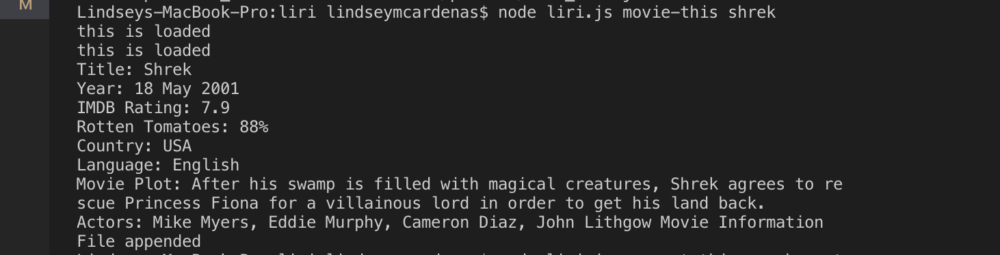
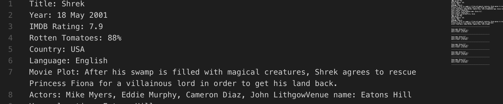

# LIRI Bot

### Overview

LIRI (Language Intepretation and Recognition Interface) is a command line node app that takes in parameters and gives you back data. 

### Before You Begin

* LIRI will search Spotify for songs, Bands in Town for concerts, and OMDB for movies, so you'll need to install the following: 
    * ```npm install spotify-api```
    * ```npm install install dotenv```
    * ```npm install moment```
    * ```npm install request```
    * ```npm install fs```
   
## How to Use

1. To find an artist's concert, enter in the console: 

    * ```node liri.js concert-this <artist name>```

* In the console, you'll see: 


* And in the appended text file you'll see: 


2. To find a song, enter in the console: 

    * ```node liri.js spotify-this-song <song name>```

* In the console, you'll see: 


* And in the appended text file you'll see: 


3. To find a movie, enter in the console: 

    * ```node liri.js movie-this <movie name>```

* In the console, you'll see: 



* And in the appended text file you'll see: 



4. To take in the text from random.txt, enter in the console: 

    * ```node liri.js do-what-it-says```

**If no movie or song is input, then it will default to "Shrek" and "The Sign by Ace of Base" respectively. ***

